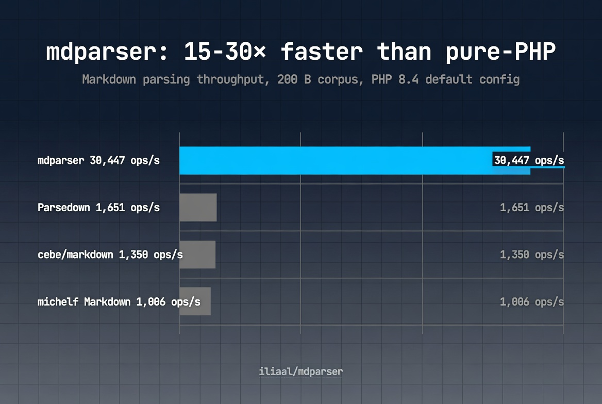

# mdparser

[](https://github.com/iliaal/mdparser/actions/workflows/tests.yml)
[](https://github.com/iliaal/mdparser/actions/workflows/windows.yml)
[](https://github.com/iliaal/mdparser/releases)
[](http://www.php.net/license/3_01.txt)
[](https://x.com/intent/follow?screen_name=iliaa)



Native C CommonMark + GitHub Flavored Markdown parser for PHP. 15-30× faster than pure-PHP alternatives (Parsedown, cebe, michelf) with full CommonMark 0.31 compliance: 652/652 spec examples pass. GFM extensions: tables, strikethrough, task lists, autolinks, tagfilter. Installable via [PIE](https://github.com/php/pie) (the PHP Foundation's PECL successor); ships as a single `.so`. PHP 8.3 minimum, OO API with `final` classes and `readonly` options.

## 📦 Install

```bash
# PIE (PHP Foundation's extension installer; uses the composer.json
# at the repo root with type: "php-ext")
pie install iliaal/mdparser
```

On a minimal PHP image (e.g. `php:8.x-cli` from Docker Hub), PIE needs a few build tools installed first:

```bash
# Debian/Ubuntu
sudo apt install -y git bison libtool-bin

# macOS
brew install bison libtool
```

### From source

```bash
git clone https://github.com/iliaal/mdparser.git
cd mdparser
phpize && ./configure --enable-mdparser
make -j
sudo make install
echo 'extension=mdparser.so' | sudo tee /etc/php/conf.d/mdparser.ini
```

### Windows binaries

Pre-built DLLs for PHP 8.3, 8.4, and 8.5 (TS/NTS, x86/x64) are attached to each [GitHub release](https://github.com/iliaal/mdparser/releases).

## 🛠️ Usage

```php
use MdParser\Parser;
use MdParser\Options;

// Default parser: safe mode on, GFM extensions on.
$parser = new Parser();
echo $parser->toHtml('# Hello');
// <h1>Hello</h1>

// Custom options via named arguments. All fields readonly.
$parser = new Parser(new Options(
    smart: true,          // --- -> em dash, -- -> en dash, "..." -> curly
    sourcepos: true,      // add data-sourcepos to every HTML element
    footnotes: true,      // enable [^ref] / [^ref]: syntax
    unsafe: false,        // raw HTML is still stripped (default)
));
echo $parser->toHtml($markdown);

// Three output formats from one parser.
$html = $parser->toHtml($markdown);
$xml  = $parser->toXml($markdown);   // CommonMark XML, DOCTYPE-wrapped
$ast  = $parser->toAst($markdown);   // nested arrays, see below

// AST shape is documented in tests/006_ast.phpt. Brief example:
// [
//   'type' => 'document',
//   'children' => [
//     ['type' => 'heading', 'level' => 1, 'children' => [
//        ['type' => 'text', 'literal' => 'Hello'],
//     ]],
//   ],
// ]
```

## 📊 Performance

Against the major pure-PHP Markdown libraries, on PHP 8.4 with each parser in its default configuration:

| Parser | Small (200 B) | Medium (1.8 KB) | Large (200 KB) |
|---|--:|--:|--:|
| **mdparser** | **30447 ops/s** | **5697 ops/s** | **105 ops/s** |
| Parsedown | 1651 ops/s (18x slower) | 325 ops/s (17x) | 6 ops/s (17x) |
| cebe/markdown (GFM) | 1350 ops/s (22x) | 374 ops/s (15x) | 6 ops/s (16x) |
| michelf (Markdown Extra) | 1006 ops/s (30x) | 209 ops/s (27x) | 5 ops/s (19x) |

15-30× faster across the board, from small messages to full 200 KB spec documents. See [`bench/README.md`](bench/README.md) for methodology, corpora, caveats, league/commonmark notes, and how to reproduce these numbers yourself.

## ✨ Feature matrix

Comparison with the major pure-PHP Markdown libraries. "via ext" means the feature exists but requires opting in to a non-default extension; "Extra" means the feature ships in the library's Markdown Extra dialect, not its base mode; "✗" means the feature is not supported at all.

| Feature              | mdparser                | Parsedown   | league/cm core | cebe GFM | michelf Extra | Ciconia |
|----------------------|-------------------------|-------------|----------------|----------|---------------|---------|
| CommonMark core      | ✓                       | partial     | ✓              | partial  | partial       | partial |
| Fenced code blocks   | ✓                       | ✓           | ✓              | ✓        | ✓             | ✓       |
| GFM tables           | ✓                       | ✓           | via ext        | ✓        | via Extra     | ✓       |
| Strikethrough        | ✓                       | ✓           | via ext        | ✓        | ✗             | ✓       |
| Task lists           | ✓                       | ✗           | via ext        | ✗        | ✗             | ✓       |
| Autolinks (bare URL) | ✓                       | ✓           | via ext        | ✓        | ✗             | ✓       |
| `<script>` tag filter| ✓ (tagfilter)           | ✓ (escaped) | via ext        | partial  | ✗             | ✗       |
| Smart punctuation    | ✓ (`Options::smart`)    | ✗           | via ext        | ✗        | ✗             | ✗       |
| Footnotes            | ✓ (`Options::footnotes`)| Extra       | via ext        | ✗        | ✓ Extra       | plugin  |
| Hardbreaks/nobreaks  | ✓                       | ✗           | ✗              | ✗        | ✗             | ✗       |
| Sourcepos            | ✓                       | ✗           | ✓              | ✗        | ✗             | ✗       |
| Heading anchors      | ✓ (`Options::headingAnchors`) | ✗     | via ext        | ✗        | ✗             | ✗       |
| `rel="nofollow"`     | ✓ (`Options::nofollowLinks`)  | ✗     | via ext        | ✗        | ✗             | ✗       |
| HTML output          | ✓                       | ✓           | ✓              | ✓        | ✓             | ✓       |
| XML output           | ✓                       | ✗           | ✗              | ✗        | ✗             | ✗       |
| AST output           | ✓ (arrays)              | ✗           | ✓ (objects)    | ✗        | ✗             | ✗       |

## What we don't cover

mdparser is deliberately scoped to what cmark-gfm supports: CommonMark core plus the five GFM extensions. It does **not** cover the "Markdown Extra" family of features that Parsedown Extra, michelf Markdown Extra, and league/commonmark's optional extensions offer. If you need any of the following, reach for league/commonmark, the most actively-maintained pure-PHP option for extended Markdown:

- Definition lists (`Term :: definition`)
- Abbreviations (`*[HTML]: ...`)
- Attribute syntax (`{.class #id key="val"}`)
- Permalink anchor markup (we emit heading `id` slugs; we don't inject
  the inner `<a class="anchor">` element GitHub uses for permalinks)
- Table of contents
- YAML front matter
- Mentions (`@user`)
- LaTeX math (`$$...$$`)
- Emoji (`:smile:`)
- Custom admonition containers (`::: warning`)

These are real features. They're just not in scope for a CommonMark+GFM core parser, and cmark-gfm doesn't implement them.

## A note on `unsafe: true`

`Options::unsafe = true` tells cmark to pass raw HTML through verbatim instead of escaping or stripping it. The contract for this mode is that you own the input: it is yours, or it comes from a pipeline you trust. Two postprocess interactions are worth knowing if you also turn on `headingAnchors` or `nofollowLinks`:

- **Heading slug positioning under raw `<hN>`.** mdparser locates each AST heading in the rendered HTML by rendering it standalone and matching its exact byte sequence. Raw `<h1>x</h1>` blocks written directly in the markdown source are therefore left untouched and do not consume slugs. The narrow exception is when raw and real produce byte-identical output (same level, same inner text, same sourcepos), in which case the `id` attribute lands on the first match.
- **`nofollowLinks` is byte-pattern based.** It rewrites every literal `<a href="...">` it finds in the output. With `unsafe: true` this includes anchor-shaped substrings inside raw HTML attribute values or inside `<script>` / `<style>` block contents. Don't combine `nofollowLinks` with `unsafe: true` if your input contains scripts or attribute-embedded anchor literals you need to preserve.

In-document fragment anchors (`href="#..."`) are intentionally skipped by `nofollowLinks`, so footnote references and backrefs stay clean.

## 🔗 PHP Performance Toolkit

Companion native PHP extensions for high-throughput PHP workloads:

- **[php_excel](https://github.com/iliaal/php_excel)**: native Excel I/O. 7-10× faster than PhpSpreadsheet, full XLS/XLSX with formulas, formatting, and styling. Powered by LibXL.
- **[php_clickhouse](https://github.com/iliaal/php_clickhouse)**: native ClickHouse client speaking the wire protocol directly. Picks up where SeasClick left off.

## 📚 Read more

Full background, design rationale, and benchmark methodology in the launch post: [mdparser: A Native CommonMark + GFM Parser for PHP](https://ilia.ws/blog/mdparser-a-native-commonmark-gfm-parser-for-php).

## License

- Wrapper code (`mdparser*.c`, `php_mdparser.h`) under the PHP License 3.01.
- Embedded cmark-gfm sources under BSD-2-Clause, MIT, and related permissive licenses. See `LICENSE` for aggregated notices.

---

[Follow @iliaa on X](https://x.com/iliaa) • [Blog](https://ilia.ws) • If this sped up your stack, ⭐ star it!
