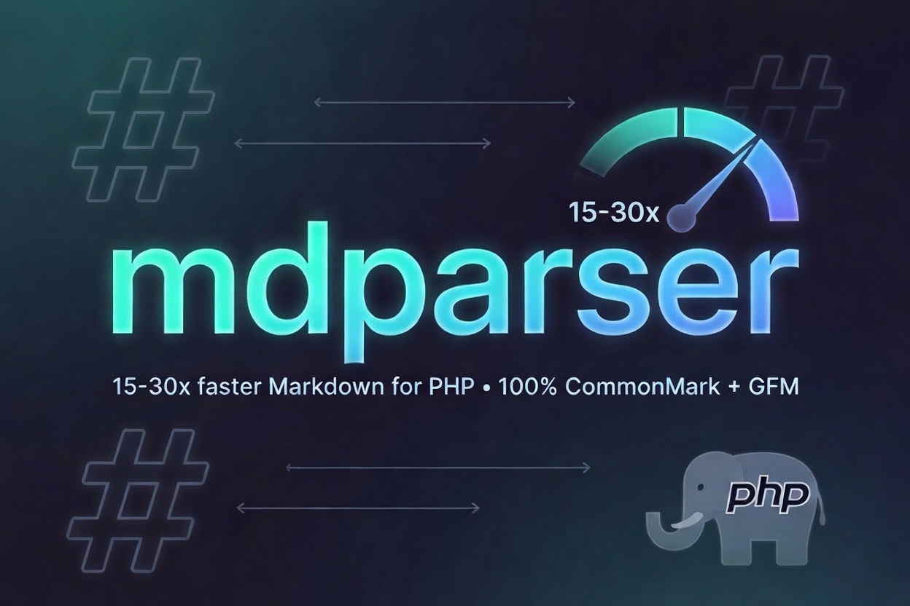

# mdparser

[](https://github.com/iliaal/mdparser/actions/workflows/tests.yml)
[](https://github.com/iliaal/mdparser/actions/workflows/windows.yml)
[](https://github.com/iliaal/mdparser/releases)
[](https://opensource.org/licenses/BSD-3-Clause)
[](https://x.com/intent/follow?screen_name=iliaa)



Native C CommonMark + GitHub Flavored Markdown parser for PHP. ~10-20× faster than pure-PHP alternatives (Parsedown, cebe, michelf) on a clean optimized build, targeting CommonMark 0.31 (652/652 spec examples pass; see `docs/spec-coverage.md`). GFM extensions: tables, strikethrough, task lists, autolinks, tagfilter. Installable via [PIE](https://github.com/php/pie) (the PHP Foundation's PECL successor); ships as a single `.so`. PHP 8.2 minimum, OO API with `final` classes and `readonly` options.

## 📦 Install

```bash
# PIE (PHP Foundation's extension installer; uses the composer.json
# at the repo root with type: "php-ext")
pie install iliaal/mdparser
```

On a minimal PHP image (e.g. `php:8.x-cli` from Docker Hub), PIE needs a few build tools installed first:

```bash
# Debian/Ubuntu
sudo apt install -y git bison libtool-bin

# macOS
brew install bison libtool
```

### From source

```bash
git clone https://github.com/iliaal/mdparser.git
cd mdparser
phpize && ./configure --enable-mdparser
make -j
sudo make install
echo 'extension=mdparser.so' | sudo tee /etc/php/conf.d/mdparser.ini
```

### Windows binaries

Pre-built DLLs for PHP 8.3, 8.4, and 8.5 (TS/NTS, x86/x64) are attached to each [GitHub release](https://github.com/iliaal/mdparser/releases).

## 🛠️ Usage

```php
use MdParser\Parser;
use MdParser\Options;

// Default parser: safe mode on, GFM extensions on.
$parser = new Parser();
echo $parser->toHtml('# Hello');
// <h1>Hello</h1>

// Custom options via named arguments. All fields readonly.
$parser = new Parser(new Options(
    smart: true,          // --- -> em dash, -- -> en dash, "..." -> curly
    footnotes: true,      // enable [^ref] / [^ref]: syntax
    unsafe: false,        // raw HTML is escaped (default)
));
echo $parser->toHtml($markdown);

// Presets for common setups.
$github     = new Parser(Options::github());     // GFM + footnotes + alerts
$strict     = new Parser(Options::strict());     // CommonMark, no bare-URL autolinks
$permissive = new Parser(Options::permissive()); // trusted input: raw HTML passes through

// Three output formats from one parser.
$html = $parser->toHtml($markdown);
$xml  = $parser->toXml($markdown);   // CommonMark XML, DOCTYPE-wrapped
$ast  = $parser->toAst($markdown);   // nested arrays, see below

// AST shape is documented in tests/006_ast.phpt. Brief example:
// [
//   'type' => 'document',
//   'children' => [
//     ['type' => 'heading', 'level' => 1, 'children' => [
//        ['type' => 'text', 'literal' => 'Hello'],
//     ]],
//   ],
// ]
```

## 📊 Performance

Against the major pure-PHP Markdown libraries, on PHP 8.4 (clean optimized build, each parser in its default configuration):

| Corpus | mdparser ops/sec | Best pure-PHP ops/sec | Speedup |
|---|--:|--:|--:|
| 200 B  | ~530,000 | ~26,000 (Parsedown)  | ~20× |
| 1.8 KB | ~110,000 | ~6,000 (cebe/GitHub) | ~19× |
| 200 KB | ~980     | ~95 (cebe/GitHub)    | ~10× |

Against the slowest pure-PHP parser the gap reaches ~45×. [`bench/README.md`](bench/README.md) has the methodology, all parsers, caveats, league/commonmark notes, and reproduction steps. Benchmark a clean optimized PHP build; a debug or ASan build skews the numbers.

## ✨ Feature matrix

Comparison with the major pure-PHP Markdown libraries. "via ext" means the feature exists but requires opting in to a non-default extension; "Extra" means the feature ships in the library's Markdown Extra dialect, not its base mode; "✗" means the feature is not supported at all.

| Feature              | mdparser                | Parsedown   | league/cm core | cebe GFM | michelf Extra | Ciconia |
|----------------------|-------------------------|-------------|----------------|----------|---------------|---------|
| CommonMark core      | ✓                       | partial     | ✓              | partial  | partial       | partial |
| Fenced code blocks   | ✓                       | ✓           | ✓              | ✓        | ✓             | ✓       |
| GFM tables           | ✓                       | ✓           | via ext        | ✓        | via Extra     | ✓       |
| Strikethrough        | ✓                       | ✓           | via ext        | ✓        | ✗             | ✓       |
| Task lists           | ✓                       | ✗           | via ext        | ✗        | ✗             | ✓       |
| Autolinks (bare URL) | ✓                       | ✓           | via ext        | ✓        | ✗             | ✓       |
| `<script>` tag filter| ✓ (tagfilter)           | ✓ (escaped) | via ext        | partial  | ✗             | ✗       |
| Smart punctuation    | ✓ (`Options::smart`)    | ✗           | via ext        | ✗        | ✗             | ✗       |
| Footnotes            | ✓ (`Options::footnotes`)| Extra       | via ext        | ✗        | ✓ Extra       | plugin  |
| Hardbreaks/nobreaks  | ✓                       | ✗           | ✗              | ✗        | ✗             | ✗       |
| Sourcepos            | ✗                       | ✗           | ✓              | ✗        | ✗             | ✗       |
| Heading anchors      | ✓ (`Options::headingAnchors`) | ✗     | via ext        | ✗        | ✗             | ✗       |
| `rel="nofollow"`     | ✓ (`Options::nofollowLinks`)  | ✗     | via ext        | ✗        | ✗             | ✗       |
| HTML output          | ✓                       | ✓           | ✓              | ✓        | ✓             | ✓       |
| XML output           | ✓                       | ✗           | ✗              | ✗        | ✗             | ✗       |
| AST output           | ✓ (arrays)              | ✗           | ✓ (objects)    | ✗        | ✗             | ✗       |

## Opt-in dialect extensions

md4c also ships dialect extensions beyond CommonMark + GFM. Each one is an opt-in `Options` flag, off by default: `latexMath` (`$inline$`, `$$block$$`), `wikiLinks` (`[[target]]`), `spoilers` (`||text||`), `underline`, `highlight` (`==text==`), `superscript` (`^text^`), `subscript` (`~text~`), `admonitions` (GitHub-style `> [!NOTE]` alert blocks), `insert` (`++text++` renders `<ins>`), and `preserveBlankLines` (blank-line runs are reported instead of discarded, visible in `toXml()` and `toAst()`). Parser-behavior toggles: `noIndentedCodeBlocks`, `permissiveAtxHeadings`, `collapseWhitespace`. See [`docs/options.md`](docs/options.md) for behavior and edge cases.

## What we don't cover

mdparser covers CommonMark core plus the GFM extensions. It doesn't implement the "Markdown Extra" features found in Parsedown Extra, michelf Markdown Extra, and league/commonmark's optional extensions. If you need any of the following, use league/commonmark, the most actively maintained pure-PHP option for extended Markdown:

- Definition lists (`Term :: definition`)
- Abbreviations (`*[HTML]: ...`)
- Attribute syntax (`{.class #id key="val"}`)
- Permalink anchor markup (we emit heading `id` slugs; we don't inject
  the inner `<a class="anchor">` element GitHub uses for permalinks)
- Table of contents
- YAML front matter
- Mentions (`@user`)
- Emoji (`:smile:`)
- Fenced admonition containers (`::: warning`); GitHub-style `> [!NOTE]`
  alert blocks are supported via `Options::admonitions`, and are on by
  default in `Options::github()`

## Bounding parse memory

The parser's own working memory comes from libc rather than Zend MM, so `memory_limit` never sees it. Markdown amplifies that memory: one `[` byte commits about 72 bytes of parser state and one `>` byte about 40 to 56, so a few megabytes of hostile input can ask for gigabytes.

`mdparser.parse_memory_limit` caps what a single parse may hold, defaulting to `128M`. Crossing it throws `MdParser\Exception`. The setting is `PHP_INI_ALL`, takes the usual `128M` / `1G` shorthand, and treats `0` or any negative value as unlimited. With the limit off, 256MB of the worst-case byte (~72B per '[') can ask libc for ~18GB. Raise the limit if you render very large documents; lower it if you render untrusted Markdown in long-lived workers. Rendered output is separate and stays under `memory_limit`.

## A note on `unsafe: true`

`Options::unsafe = true` passes raw HTML through verbatim instead of escaping or stripping it. Use it only for input you own or a pipeline you trust. `headingAnchors` and `nofollowLinks` run in-stream as md4c parses the source, so they touch only Markdown-derived nodes. Raw HTML is emitted verbatim and never rewritten:

- Heading anchors apply to Markdown headings only. A `# heading` gets an `id` slug. A raw `<h1>x</h1>` block (possible under `unsafe: true, tagfilter: false`) is emitted untouched and gets no id, so it never collides with a later Markdown heading that has the same text.
- `nofollowLinks` applies to Markdown links only. Inline links, reference links, and autolinks get `rel="nofollow noopener noreferrer"`; in-document fragment anchors (`href="#..."`, including footnote references and backrefs) are skipped. A raw `<a href="...">` passes through verbatim. Sanitize raw HTML yourself if you allow it.

### Structural outputs are unsanitized

`Parser::toXml()` and `Parser::toAst()` return structural representations of the parsed document. `html_block` / `html_inline` literals are preserved byte-for-byte (XML-escaped in `toXml()`); link and image URLs and titles are entity-decoded but not scheme-filtered. The `unsafe`, `tagfilter`, and URL-scheme defenses don't make these outputs safe to turn back into HTML. If you build HTML from XML or AST data, apply a URL scheme allowlist before emitting `href`, and run `html_block` / `html_inline` literal text through a sanitizer. See `docs/ast.md` for examples.

## 🔗 Native PHP extensions

Companion native PHP extensions:

- **[php_excel](https://github.com/iliaal/php_excel)**: native Excel I/O via LibXL. 7-10× faster than PhpSpreadsheet, full XLS/XLSX with formulas, formatting, and styling.
- **[php_clickhouse](https://github.com/iliaal/php_clickhouse)**: native ClickHouse client speaking the wire protocol directly. Picks up where SeasClick left off.
- **[pdo_duckdb](https://github.com/iliaal/pdo_duckdb)**: PDO driver for DuckDB, analytical SQL in your PHP stack.
- **[fastjson](https://github.com/iliaal/fastjson)**: drop-in faster `ext/json`, backed by yyjson. 6× encode, 2.7× decode, 5× validate.
- **[phpser](https://github.com/iliaal/phpser)**: decoder-optimized binary serializer for cache workloads. Faster than igbinary on packed numerics and DTO batches.
- **[fast_uuid](https://github.com/iliaal/fast_uuid)**: high-throughput UUID generation (v1/v4/v7), batched CSPRNG and SIMD hex formatter, ramsey-compatible API.
- **[fastchart](https://github.com/iliaal/fastchart)**: native chart-rendering extension. 38 chart types behind one fluent OO API, SVG-canonical with PNG/JPG/WebP and optional PDF output.
- **[statgrab](https://github.com/iliaal/statgrab)**: system statistics (CPU, memory, disk, network) via libstatgrab, no parsing /proc by hand.
- **[phonetic](https://github.com/iliaal/phonetic)**: native phonetic name matching (Double Metaphone, Beider-Morse, Daitch-Mokotoff, NYSIIS, Match Rating), the encoders PHP core lacks.

## 📚 Read more

The launch post covers background, design rationale, and benchmark methodology: [mdparser: A Native CommonMark + GFM Parser for PHP](https://ilia.ws/blog/mdparser-a-native-commonmark-gfm-parser-for-php).

## License

- Wrapper code (`mdparser*.c`, `php_mdparser.h`) under BSD 3-Clause.
- Embedded md4c sources under the MIT license. See `LICENSE` for aggregated notices.

---

[Follow @iliaa on X](https://x.com/iliaa) • [Blog](https://ilia.ws) • If this sped up your stack, ⭐ star it!
